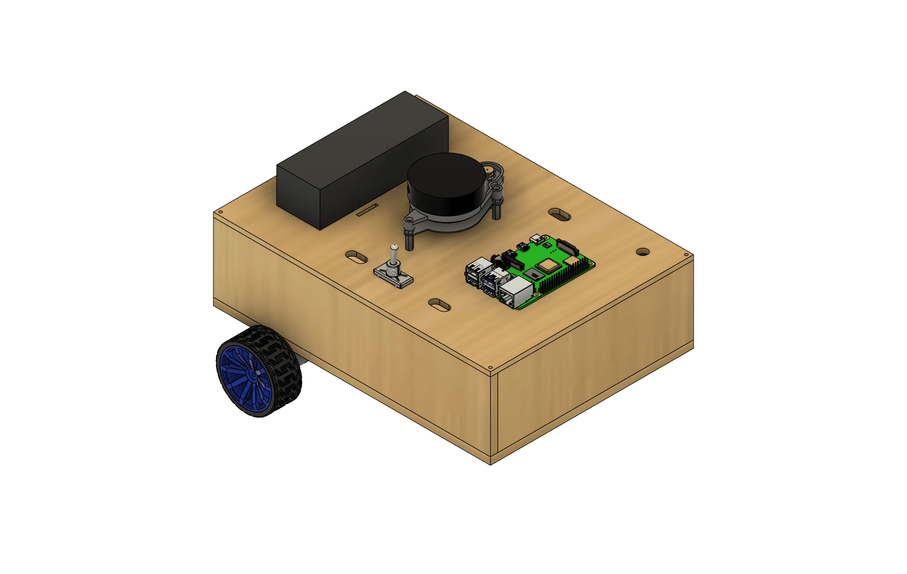
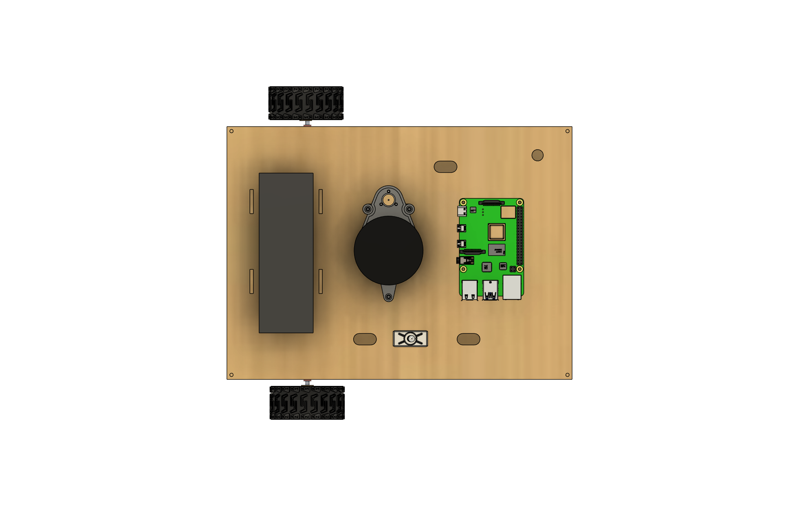
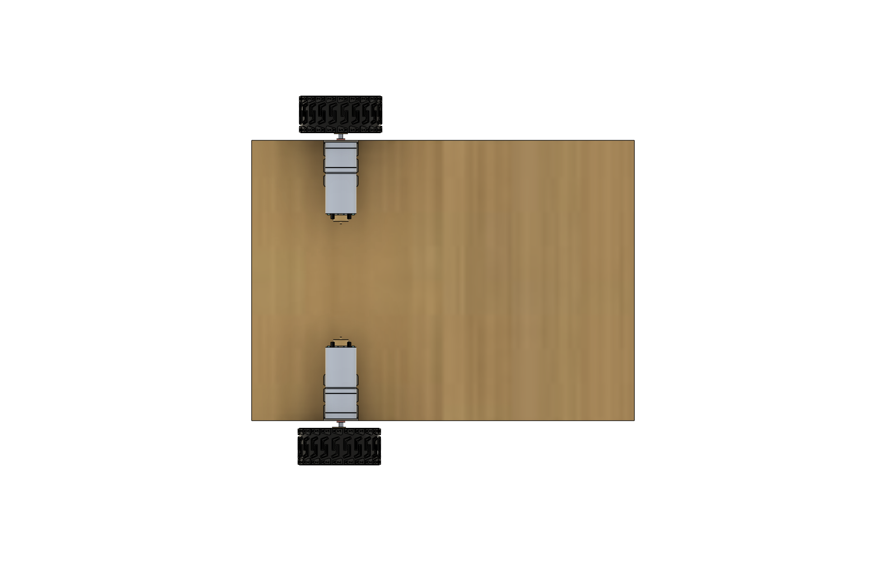

# ROS2 Differential Robot

This repository contains all the necessary files and resources to build and run a **low-cost homemade differential robot** based on **ROS2**.

## 🗂 Repository Structure

### 📁 Hardware

The 'hardware/' directory includes:
- CAD models of the full assembly
- .xdf for laser-cut wooden parts
- STL files for 3D-printed components

### 📁 diffbot_ws

The 'diffbot_ws/' folder is a complete **ROS2 workspace** that includes:
- Robot description (URDF, xacro)
- Sensor drivers (IMU, encoders, etc.)
- Motor control nodes
- Teleoperation support
- Launch files for simulation and real robot
- Localization and odometry integration

### 📁 utils

The utils/ folder contains a collection of utility scripts and tools designed to simplify the development, testing, and deployment of the robot. It includes:

## 🤖 About the Robot

This is a **differential drive robot** built with affordability and modularity in mind. It serves as a first prototype and learning platform for robotics and ROS2 development.

Components:
- 2x DC Motors with Encoder -> https://amzn.eu/d/aTJvIgY
- Raspberry pi 4 (8GB) -> https://amzn.eu/d/gJoqJDg
- 11.1V LiPo Battery -> https://amzn.eu/d/0fujazv
- RPLIDAR A1M8 -> https://amzn.eu/d/6fyjb1o
- ESP32-S3-DevKitC-1 -> https://amzn.eu/d/iINVQQF

## Considerations

Below are some important notes to keep in mind during the development of this project. These are essential to ensure the correct behavior of the robot:

- Make sure to use the same ROS_DOMAIN_ID on both the Raspberry Pi and the local machine. This can be configured in the .bashrc file.
- The pinout of your system can be easily changed in the config.h file located at diffbot_ws/src/diffbot_firmware/firmware/robot_control/src/config.h.
- To work with Wi-Fi communication, ensure both devices are on the same network and that multicast traffic is not blocked.

## From sim2real

  
  
  

